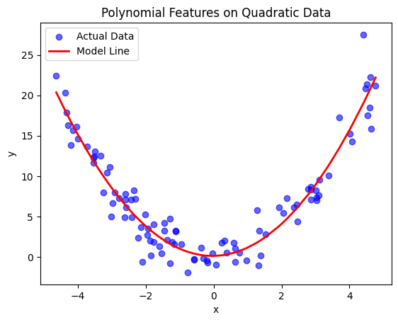
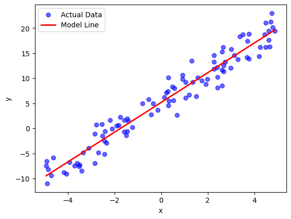
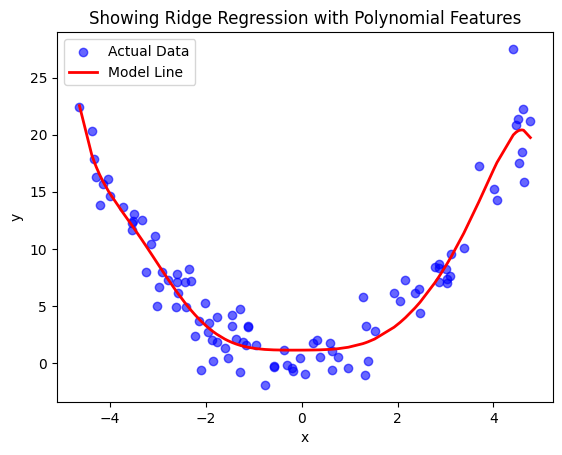

# When Linear Regression Fails (and How to Fix It)

## Overview

This project explores the limitations of Linear Regression and demonstrates how to fix its failure cases using Polynomial Features and Ridge Regression.

The goal is to build intuition about:

* When linear models work
* When they fail
* How increasing model complexity affects performance
* How regularization helps control overfitting

---

## Experiments

### 1. Linear Data

* Generated data using: y = 3x + 5 + noise
* Linear Regression fits the data well
* Model successfully learns the underlying relationship

**Observation:**
Linear models work well when the true relationship is linear.

---

### 2. Non-Linear (Quadratic) Data

* Generated data using: y = x² + noise
* Applied Linear Regression

**Observation:**
The model fails because it can only fit a straight line, while the data is curved.

---

### 3. Fix using Polynomial Features

* Transformed input from x → [1, x, x²]
* Trained Linear Regression on transformed features

**Observation:**
Model now fits the curve well.
Key idea: we did not change the model, only the representation of input.

---

### 4. Overfitting (High-Degree Polynomial)

* Used polynomial degree = 10
* Model fits training data extremely well

**Observation:**
Model starts fitting noise → highly wiggly curve
This leads to poor generalization.

---

### 5. Fix using Ridge Regression

* Applied Ridge Regression with polynomial degree = 10
* Introduced regularization (controlled by alpha)

**Observation:**

* Curve becomes smoother
* Overfitting is reduced
* Model generalizes better

---

## Key Concepts Learned

* Linear Regression can only model linear relationships
* Feature engineering can extend model capability
* Higher model complexity can lead to overfitting
* Regularization helps prevent overfitting by penalizing large weights

---

## Key Insights (Interview Ready)

1. Linear Regression fails when the relationship between input and output is non-linear.
2. Feature engineering (like polynomial features) can make linear models more powerful.
3. Increasing model complexity improves training performance but can harm generalization.
4. Overfitting occurs when a model learns noise instead of the true pattern.
5. Ridge Regression helps control overfitting by constraining model weights.

---

## Tech Stack

* Python
* NumPy
* Matplotlib
* scikit-learn

----

## Results

